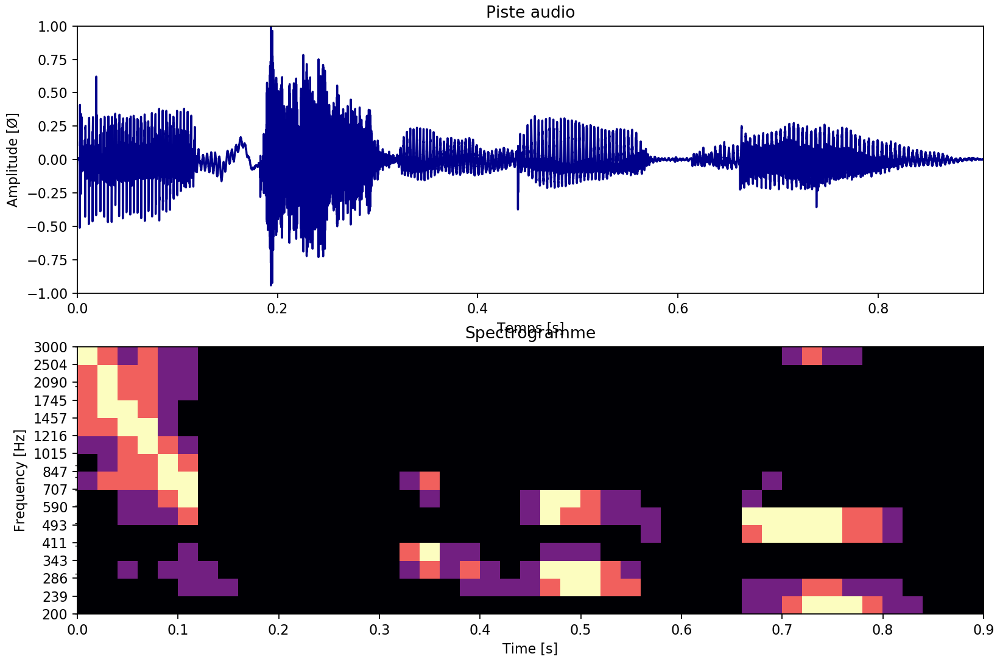

## Etude de la détection automatique de caractéristiques sur un signal audio

## [Cliquez ici pour lire le compte-rendu en ligne](/Compte-rendu.ipynb).

## Liste des fonctions disponibles

Vous trouverez ci-dessous une liste contenant les différentes fonctions implémentées.

| Nom de la fonction | Description |
| -------- | ----------- |
|| **Traitement d'un signal audio** |
| [compute](https://github.com/lowlighter/sound/blob/master/bin/compute.py) | Ouvre un fichier, génère une banque de filtre, utilise un compresseur audio (facultatif) et affiche le spectre d'amplitude et le spectrogramme personnalisé |
| [compare](https://github.com/lowlighter/sound/blob/master/bin/compare.py) | Compare plusieurs fichiers audios (via la fonction **compute**) |
| [live_record](https://github.com/lowlighter/sound/blob/master/bin/live_record.py) | Traite les données reçus par le microphone de l'ordinateur *(nécessite pyaudio)* |
|| **Propriétés du signal audio** |
| [plot_specamp](https://github.com/lowlighter/sound/blob/master/bin/plot_specamp.py) | Spectre d'amplitude |
| [plot_dbfs](https://github.com/lowlighter/sound/blob/master/bin/plot_dbfs.py) | Spectre dB FS |
| [plot_specgram](https://github.com/lowlighter/sound/blob/master/bin/plot_specgram.py) | Spectrogramme |
| [plot_avggram](https://github.com/lowlighter/sound/blob/master/bin/plot_avggram.py) | Spectrogramme (moyenne) |
| [plot_nspecgram](https://github.com/lowlighter/sound/blob/master/bin/plot_fft.py) | Spectrogramme natif |
| [plot_formants](https://github.com/lowlighter/sound/blob/master/bin/plot_formatns.py) | Ajoute les formants connus sur une figure existante |
|| **Compresseur audio** |
| [drc](https://github.com/lowlighter/sound/blob/master/bin/drc.py) | Applique un compresseur audio à un signal |
| [drcz](https://github.com/lowlighter/sound/blob/master/bin/drcz.py) | Réponse linéaire d'un compresseur audio |
|| **Convertisseur analogique numérique** |
| [adc](https://github.com/lowlighter/sound/blob/master/bin/adc.py) | Numérise un signal |
|| **Filtres et banque de filtres** |
| [bandpass](https://github.com/lowlighter/sound/blob/master/bin/bandpass.py) | Génère un filtre |
| [gen_filters](https://github.com/lowlighter/sound/blob/master/bin/gen_filters.py) | Génère une banque de filtre |
| [plot_freqz](https://github.com/lowlighter/sound/blob/master/bin/plot_freqz.py) | Réponse fréquentielle d'une banque de filtre |
| [gen_filtered](https://github.com/lowlighter/sound/blob/master/bin/gen_filtered.py) | Filtre un signal par une banque de filtre |
| [plot_filtered](https://github.com/lowlighter/sound/blob/master/bin/plot_filtered.py) | Affiche un signal filtré par une banque de filtre |
|| **Energie d'un signal** |
| [energy](https://github.com/lowlighter/sound/blob/master/bin/energy.py) | Calcule l'énergie d'un signal (un seul segment temporel) |
| [energies](https://github.com/lowlighter/sound/blob/master/bin/energies.py) | Calcule l'énergie d'un signal (segments temporel espacés uniformément) |
| [plot_energies](https://github.com/lowlighter/sound/blob/master/bin/plot_energies.py) | Affiche l'énergie d'un signal (segments temporel espacés uniformément) |
|| **Spectrogramme personnalisé d'un signal** |
| [gen_data](https://github.com/lowlighter/sound/blob/master/bin/gen_data.py) | Génère les données du spectrogramme personnalisé |
| [plot_datagram](https://github.com/lowlighter/sound/blob/master/bin/plot_datagram.py) | Affiche le spectrogramme personnalisé |
| [plot_data](https://github.com/lowlighter/sound/blob/master/bin/plot_data.py) | Affiche le spectre d'amplitude et le spectrogramme personnalisé |
|| **Etude d'un signal** |
| [gen_sine](https://github.com/lowlighter/sound/blob/master/bin/gen_sine.py) | Génère un signal sinusoïdal |
| [similar](https://github.com/lowlighter/sound/blob/master/bin/similar.py) | Corrélation entre deux signaux |
| [similarities](https://github.com/lowlighter/sound/blob/master/bin/similarities.py) | Corrélation entre plusieurs signaux (via la fonction compare) |
| [learning](https://github.com/lowlighter/sound/blob/master/bin/learning.py) | Entraine et teste un Perceptron multicouche (Multi-layer Perceptron classifier) |
|| **Manipulation d'un signal** |
| [state_at](https://github.com/lowlighter/sound/blob/master/bin/state_at.py) | Lit la valeur d'un spectrogramme personnalisé pour un filtre et un instant donné |
| [cut](https://github.com/lowlighter/sound/blob/master/bin/cut.py) | Découpe un spectrogramme personnalisé en sections |
| [to1D](https://github.com/lowlighter/sound/blob/master/bin/to1D.py) | Normalise un spectrogramme personnalisé en un tableau unidimensionnel |
|| **Banc de tests** |
| [benchmark](https://github.com/lowlighter/sound/blob/master/bin/benchmark.py) | Effectue un banc de tests |
