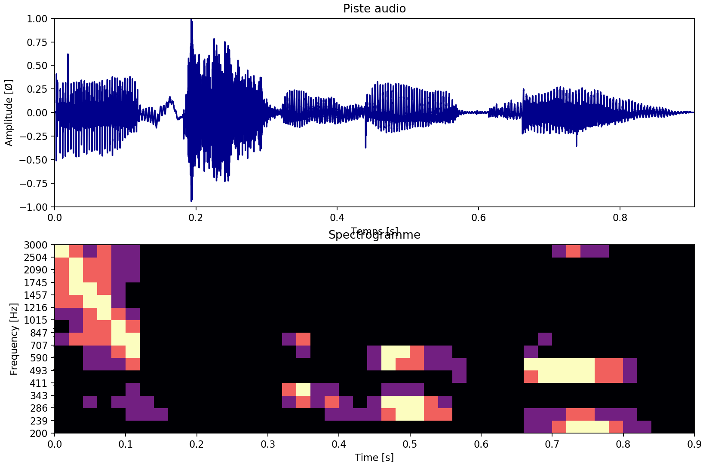

## Etude de la détection automatique de caractéristiques sur un signal audio


### [Cliquez ici pour lire le compte-rendu en ligne](/Compte-rendu.ipynb).

# Liste des fonctions disponibles

Vous pouvez consulter le code source de chaque fonction et leur documentation dans le dossier [/bin](https://github.com/lowlighter/sound/tree/master/bin) ou tapez le code
suivant pour afficher de l'aide sur une fonction :
```python
help(function)
```

## Traitement d'un signal audio
**Ouvrir un fichier, générer une banque de filtre et d'afficher son spectre d'amplitude ainsi que son spectrogramme personnalisé**
```python
compute(
  file, fs=0,
  q=0, n=0,
  fcs=[],
  nb_filters=0, fmin=0, fmax=0,
  filters=[], filters_fq=[],
  time_res=0, amp_res=0,
  ax=None, plotd=True,
  spec_only=False, spec_xlim=False, vmax=0,
  drc_tl=False, drc_th=False, drc_r=False
)
# < rsegs, rfreqs, rseqs
```

**Comparer plusieurs fichiers audios**
```python
compare(
  files, folder="", format=".wav",
  q=0, n=0,
  fcs=[],
  nb_filters=0, fmin=0, fmax=0,
  filters=[], filters_fq=[],
  time_res=0, amp_res=0,
  plotd=True, scaled_y=False,
  drc_tl=False, drc_th=False, drc_r=False
)
# < rseqs
```

**Traitement des données reçus par le microphone de l'ordinateur** *(nécessite pyaudio)*
```python
live_record(filters, filters_fq, time_res, amp_res)
```
## Propriétés du signal audio
**Afficher le spectre d'amplitude**
```python
plot_specamp(y, t, ax=None, title="Piste audio", color="darkblue")
```

**Afficher le spectre db FS**
```python
plot_dbfs(y, t, ax=None, title="Piste audio", color="green")
```

**Afficher le spectrogramme**
```python
plot_specgram(y, t, fs, ax=None)
```
## Compresseur audio
**Appliquer un compresseur audio à un signal**
```python
drc(y, tl=False, th=False, ratio=1)
# < yy
```

**Afficher la réponse linéaire d'un compresseur audio**
```python
drcz(tl=False, th=False, ratio=1, ax=None, title="Réponse linéaire")
```

## Filtres et banque de filtres
**Générer un filtre**
```python
bandpass(fc, q, n, fs, debug=False):
# < filter, fc, fl, fh
```
**Générer une banque de filtre**
```python
gen_filters(q, n, fs, nb_filters=12, fmin=20, fmax=20000, fcs=[], debug=False)
# < filters, filters_fq
```
**Afficher la réponse fréquentielle d'une banque de filtre**
```python
plot_freqz(filters)
```
**Filtrer un signal par une banque**
```python
gen_filtered(y, fs, filters)
# < filtered
```
**Afficher un signal filtré par une banque**
```python
plot_filtered(y, t, filtered, filters_fq, nsub=4)
```

## Energie d'un signal
**Calculer l'énergie d'un segment temporel d'un signal**
```python
energy(signal, fs, start=0, end=False)
# < seq
```
**Calculer l'énergie d'un signal par segments temporels espacés uniformément**
```python
energies(signal, fs, dt, bits=False)
# < segs, seqs
```
**Afficher l'énergie d'un signal par segments temporels espacés uniformément**
```python
plot_energies(signal, fs, dt, bits)
```

## Etude d'un signal
**Générer les données du spectrogramme personnalisé**
```python
gen_data(filtered, fs, time_res, amp_res, filters_fq, vmax=0)
# < rsegs, rfreqs, rseqs
```
**Afficher le spectrogramme personnalisé**
```python
plot_datagram(rsegs, rfreqs, rseqs, ax=None, title="Spectrogramme", xlim=False)
```
**Afficher le spectre d'amplitude ainsi que le spectrogramme personnalisé**
```python
plot_data(y, t, rsegs, rfreqs, rseqs, ax=None, xlim=False)
```
**Lire la valeur numérique d'un filtre à un instant donné**
```python
state_at(filter_no, s, rsegs, rseqs, debug=False)
# < state
```
**Découpage en section**
```python
cut(rseqs)
# < cseqs
```
